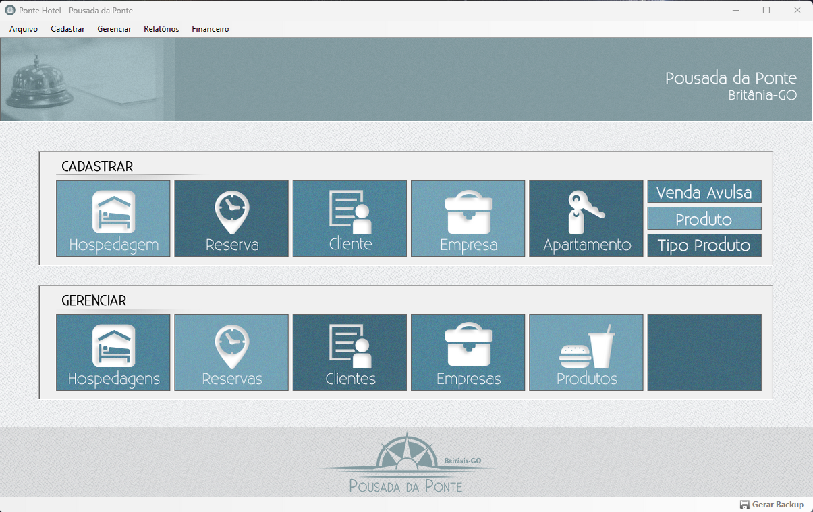
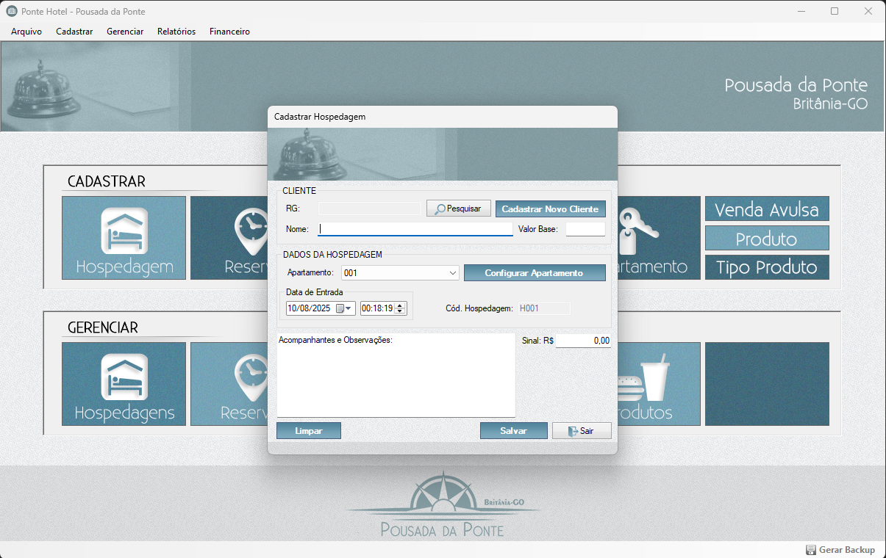

# Sistema de Hotelaria - VB.NET Windows Forms

Sistema completo para controle de hospedagem e gestão de hotelaria, desenvolvido em **VB.NET** com **Windows Forms**.  
Este sistema foi criado originalmente para atender à necessidade real do meu próprio negócio quando iniciei minha jornada empreendedora na área de hotelaria.

## 📋 Funcionalidades Principais
- Cadastro e gerenciamento de hóspedes
- Cadastro e gerenciamento de Produtos
- Controle de reservas e check-in/check-out
- Gestão de quartos e tarifas
- Relatórios de ocupação e faturamento
- Emissão de recibos

## 🛠️ Tecnologias Utilizadas
- **VB.NET** (.NET Framework)
- **Entity Framework**
- **Windows Forms**
- **SQL Server**

## 📸 Capturas de Tela

#### - Painel Principal

#### - Cadastro de Hospedagem

